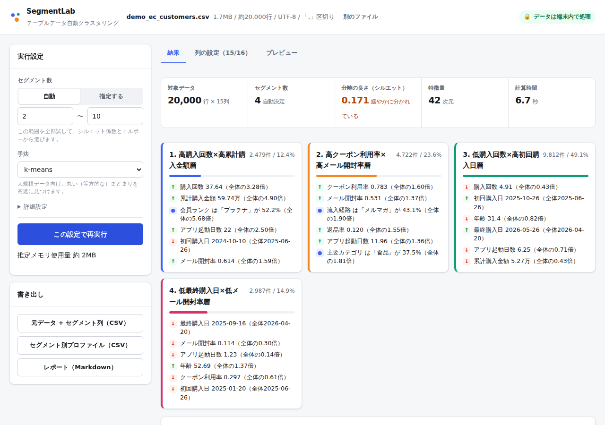
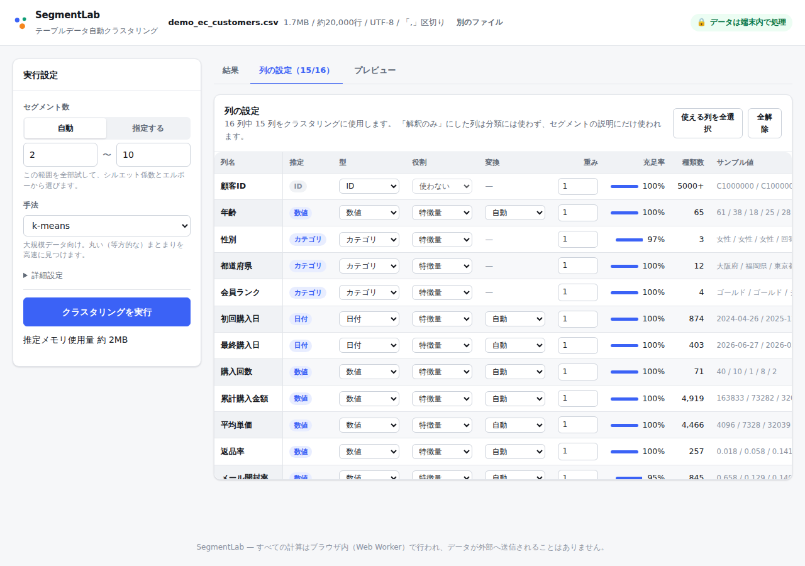

# SegmentLab

テーブルデータ（CSV / TSV / Excel）を投げるだけで、**前処理からクラスタ数の決定、セグメントの解釈まで**を自動で行うブラウザアプリです。
マーケティングの顧客セグメンテーションを主な用途として想定しています。

**すべての計算はブラウザ内（Web Worker）で完結し、データが外部に送信されることはありません。**
顧客リストのような持ち出しにくいデータでも、サーバーにアップロードせずに分析できます。



<details>
<summary>ほかの画面</summary>

**列の設定** — 型と役割は自動推定され、その場で調整できます。



</details>

## できること

| | |
| --- | --- |
| **入力** | CSV / TSV / Excel(.xlsx)。区切り文字と文字コード（UTF-8 / Shift_JIS）を自動判定 |
| **規模** | 数十行 〜 数十万行、数個 〜 数百列 |
| **前処理** | 列の型推定（数値 / カテゴリ / 日付 / 2値 / ID / 自由記述）、欠損補完、歪み補正、ワンホット化、列ごとの影響度の正規化 |
| **手法** | k-means（ミニバッチ + Lloyd）/ Ward 法（階層クラスタリング） |
| **クラスタ数** | シルエット係数とエルボー法から自動決定。手動指定も可 |
| **解釈** | セグメントごとの特徴抽出・自動命名、列ごとの分離度、主成分散布図 |
| **出力** | 元データ + セグメント列の CSV、プロファイル CSV、Markdown レポート |

## 使い方

```bash
npm install
npm run dev      # 開発サーバー
npm run build    # dist/ に静的ファイルを出力
npm run preview  # ビルド結果を確認
```

ブラウザで開いたら、CSV をドロップするか「デモデータで試す」を押してください。

1. **列の設定** — 自動推定された型と役割を確認・調整します
   - `特徴量`: クラスタリングに使う
   - `解釈のみ`: 分類には使わないが、セグメントの説明には使う（例: 都道府県、LTV）
   - `使わない`: 読み込まない
   - `重み`: 特定の列を重視したいとき（例: 累計購入金額を 3 倍にする）
2. **クラスタリングを実行**
3. **結果を確認** — セグメントカード、散布図、クラスタ数の評価、列ごとの比較表
4. **書き出し** — 元データにセグメント列を付けた CSV などをダウンロード

## 設計の要点

### 数十万行 × 数百列に耐えるための工夫

- **列指向ストア** — 数値は `Float64Array`、カテゴリは辞書 + `Int32Array` のコードで保持します。全行を文字列で持たないため、30 万行 × 16 列で約 70MB に収まります。
- **2 段階の読み込み** — 先頭 2MB だけを読んで列の型と役割を決め、ユーザーが確認してから全件を読みます。ID や自由記述の列は**そもそもメモリに載せません**。
- **ブロック単位のエンコード** — 特徴量行列は 8192 行ずつ生成し、そのまま主成分空間に射影します。エンコード後の全行分の行列を持ちません。
- **ランダム化 SVD による PCA** — 共分散行列（d×d）を作らないため、数百列でもメモリが破綻しません。特徴量が 60 次元を超えたら 50 次元に圧縮します。
- **クラスタ数の探索はサンプルで** — k の評価は 1.5 万行のサンプルで行い、決まった k で全件を分類します。
- **ミニバッチ k-means** — 5 万行を超える場合はミニバッチで粗く合わせてから Lloyd 法で仕上げます。

実測（Node 22 / 単一スレッド）:

| データ | 読み込み | クラスタリング | メモリ |
| --- | ---: | ---: | ---: |
| 30 万行 × 16 列（顧客データ） | 1.8 秒 | 7.8 秒 | 約 70MB |
| 10 万行 × 300 列（数値のみ） | 27 秒 | 20 秒 | 約 390MB |

`npm run bench` で手元でも計測できます。

### 前処理の考え方

**列ごとの影響度を揃える**のが基本方針です。
何もしないと、水準が 30 個あるカテゴリ列（ワンホットで 30 次元）が数値列 1 本を圧倒し、距離が意味を失います。
そこで、1 つの元列が特徴量空間に与える分散の合計が 1 になるよう、派生次元数 m に対して `1/√m` を掛けています。
ユーザーが指定した重みは、その上に掛かります。

数値列の変換は分布を見て自動で選びます。

| 条件 | 変換 |
| --- | --- |
| 歪度 > 8、または裾が極端に重い | 分位点変換（正規分布に写像） |
| 歪度 > 1.2 かつ非負 | `log1p` → 標準化 |
| 四分位範囲に対して外れ値が大きい | ロバスト標準化（中央値 / IQR） |
| それ以外 | 標準化 |

欠損は中央値で補完しますが、欠損率が 2〜70% の列は「未入力かどうか」自体を特徴量に追加します。マーケティングデータでは、値が入っていないこと自体が情報を持つことが多いためです。

### クラスタ数の自動決定

シルエット係数だけを見ると、実データのようにセグメントが重なっている場合はほぼ必ず k=2 が勝ってしまい、セグメンテーションとして使えません。
そこで **シルエット係数（0.55）とエルボー（0.45）** を正規化して足し合わせ、さらに次の実務的な制約を入れています。

- 全体の 2% 未満しかない極小クラスタができる k は避ける
- スコアがほぼ同じなら小さい k を選ぶ（解釈しやすさ優先）

### セグメントの解釈

各セグメントについて、次の指標から特徴を抽出し、強い順に並べて自動命名します。

- **数値列**: 全体平均からの標準化差分 `z = (平均_c − 平均_全体) / 標準偏差_全体`（効果量）と全体平均比
- **カテゴリ列**: 構成比と全体に対するリフト（`シェア_c / シェア_全体`）
- **列ごとの分離度**: 数値は η²、カテゴリは Cramér's V（どちらも 0〜1）

## プロジェクト構成

```
src/
  core/            DOM 非依存の処理層（Node でもそのままテストできる）
    csv.ts         ストリーミング CSV パーサ、区切り文字・文字コード判定
    infer.ts       列の型推定、業務データ向けの緩い数値・日付パース
    loader.ts      2 段階読み込み（inspect → load）
    columns.ts     列指向ストア（可変長の型付き配列）
    encode.ts      特徴量エンコード（変換の自動選択、影響度の正規化）
    pca.ts         ランダム化 SVD、Jacobi 法による固有分解
    kmeans.ts      k-means++ / Lloyd / ミニバッチ
    ward.ts        Ward 法（nearest-neighbor chain）
    metrics.ts     シルエット / Calinski-Harabasz / Davies-Bouldin
    describe.ts    プロファイリングと自動命名
    pipeline.ts    全体の組み立てと k の自動決定
    export.ts      CSV / Markdown の書き出し
    demo.ts        デモ用の合成データ
  worker/          上記を動かす Web Worker
  app/             React の UI
tests/             コアのユニットテスト（Node 標準の test runner）
e2e/               実ブラウザでの疎通テスト（Playwright）
scripts/bench.ts   規模別のベンチマーク
```

## 開発

```bash
npm test         # コアのユニットテスト（32 件）
npm run e2e      # ブラウザテスト（先に npm run build が必要）
npm run bench    # ベンチマーク
npm run typecheck
```

ブラウザが既にある環境では `PW_CHROMIUM_PATH=/path/to/chrome npm run e2e` で実行ファイルを指定できます。

## デプロイ

`main` への push で GitHub Pages に自動デプロイされます（`.github/workflows/deploy.yml`）。
サブパス配信のため、ビルド時に `VITE_BASE=/<リポジトリ名>/` を渡しています（ワークフローが自動で埋めます）。

このリポジトリの場合の公開 URL は `https://shunshun0904.github.io/clustering/` です。
Settings → Pages で Source を「GitHub Actions」にすると有効になります
（private リポジトリで Pages を使うには有料プランが必要です）。

静的ファイルなので、任意のホスティング（S3、Netlify、社内サーバーなど）にそのまま置けます。

## ライセンス

MIT
